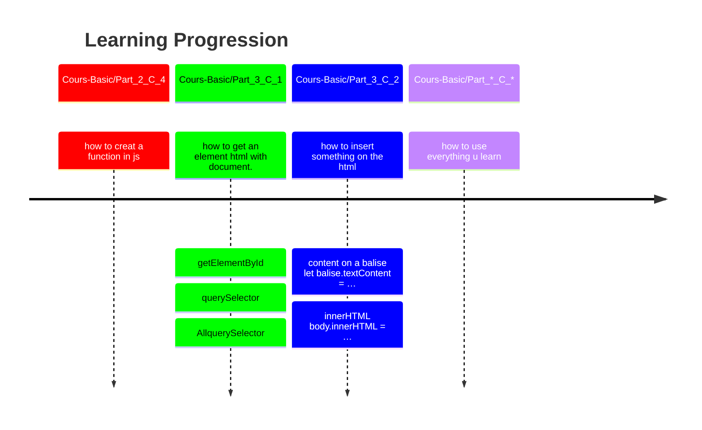

*This project has been created by Florent Cretin.*
<!-- Ceci sont des commentaire pour avec mes font et mes icon personnaliser -->
<!-- 𝔸 𝔹 ℂ 𝔻 𝔼 𝔽 𝔾 ℍ 𝔾 𝕁 𝕂 𝕃 𝕄 ℕ 𝕆 ℙ ℚ ℝ 𝕊 𝕋 𝕌 𝕍 𝕎 𝕏 𝕐 ℤ -->
<!-- 𝕒 𝕓 𝕔 𝕕 𝕖 𝕗 𝕘 𝕙 𝕚 𝕛 𝕜 𝕝 𝕞 𝕟 𝕠 𝕡 𝕢 𝕣 𝕤 𝕥 𝕦 𝕧 𝕨 𝕩 𝕪 𝕫  -->
<!-- 𝟘 𝟙 𝟚 𝟛 𝟜 𝟝 𝟞 𝟟 𝟠 𝟡 -->
<!-- 📘 🗎 🖋 👀 🗣 … -->
<!-- Double-struck font -->
<!-- 𝔸𝔹ℂ𝔻𝔼𝔽𝔾ℍ𝕀𝕁𝕂𝕃𝕄ℕ𝕆ℙℚℝ𝕊𝕋𝕌𝕍𝕎𝕏𝕐ℤ𝕒𝕓𝕔𝕕𝕖𝕗𝕘𝕙𝕚𝕛𝕜𝕝𝕞𝕟𝕠𝕡𝕢𝕣𝕤𝕥𝕦𝕧𝕨𝕩𝕪𝕫𝟘𝟙𝟚𝟛𝟜𝟝𝟞𝟟𝟠𝟡 -->

<!-- [Tag-test]: url -->
[tag-openclassroom-javascript-basic]: https://openclassrooms.com/fr/courses/7696886-apprenez-a-programmer-avec-javascript
[tag-openclassroom-javascript-dynamique]: https://openclassrooms.com/fr/courses/7697016-creez-des-pages-web-dynamiques-avec-javascript

# JavaScript

## [📘 Cours JavaScript basics][tag-openclassroom-javascript-basic]
### [📘 Cours JavaScript page dynamique][tag-openclassroom-javascript-dynamique]

<h2 id="description">𝔻escription</h2>

- [🗓 𝕊ummary](#summary)

 

---

 

    <strong id="summary">🗓 𝕊ummary</strong>

- [𝔻escription](#description)
- [𝕆bjectives](#objectives)
- [🕑 𝕃earning ℙrogression](#learningprogression)
- [📁 ℝepository Structure Tree](#rst)
- [🛠 ℝequirements](#requirements)
- [𝕃earning Notes](#learning-notes)
- [ℝesources](#resources)
- [🖋 𝔸uthor](#author)

<h2 id="objectives">𝕆bjectives</h2>

>
>
>
>
>

- [🗓 𝕊ummary](#summary)

 

---

 

<h2 id="learningprogression">🕑 𝕃earning ℙrogression</h2>

<strong>Mermaid</strong>

- [🗓 𝕊ummary](#summary)

---

 

<h2 id="requirements">🛠 ℝequirements</h2>

- [🗓 𝕊ummary](#summary)

 

---

 

<h2 id="resources">ℝesources</h2>

- [🗓 𝕊ummary](#summary)

 

---

 

<h2 id="author">🖋 𝔸uthor</h2>

All implementation decisions and documentation were written and validated by the project author.

 

---

 

- [🗓 𝕊ummary](#summary)